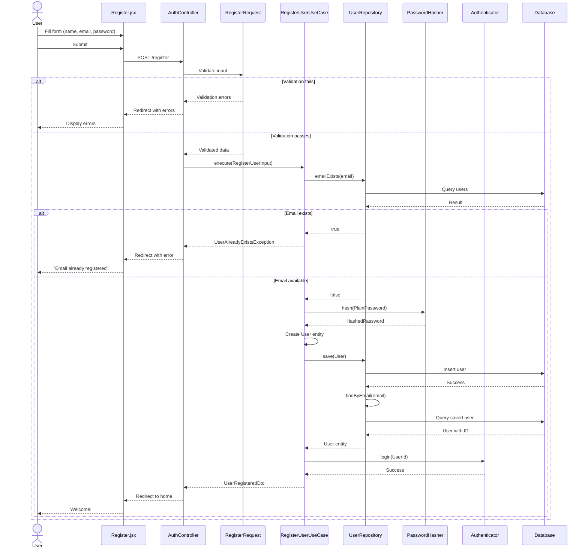

# Authentication System

Hexagonal Architecture implementation of user authentication with login and registration.

## Architecture Overview

## Domain Model

## Use Case: User Registration

### Flow Diagram

### State Diagram

## Use Case: User Login

### Flow Diagram

### State Diagram

## Use Case: User Logout

### Flow Diagram

## Authentication State Management

## Validation Rules

### Registration
- **name**: required, string, max 255 characters
- **email**: required, string, valid email format, max 255 characters, unique in users table
- **password**: required, string, minimum 8 characters

### Login
- **email**: required, string, valid email format
- **password**: required, string

## Error Handling

## Routes

| Method | Path | Action | Middleware | Description |
|--------|------|--------|------------|-------------|
| GET | `/register` | `showRegisterForm()` | guest | Display registration form |
| POST | `/register` | `register()` | guest | Process registration |
| GET | `/login` | `showLoginForm()` | guest | Display login form |
| POST | `/login` | `login()` | guest | Process login |
| POST | `/logout` | `logout()` | auth | Process logout |

## Dependency Injection Bindings

## Component Structure

## Testing Coverage

## Security Considerations

- Passwords are hashed using Laravel's `Hash` facade (bcrypt by default)
- CSRF protection via Laravel middleware
- Input validation via Form Request classes
- Guest/Auth middleware prevents unauthorized access
- Domain exceptions prevent credential enumeration
- Session-based authentication via Laravel's Auth system
